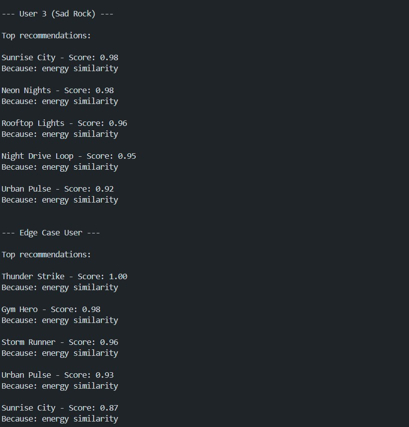
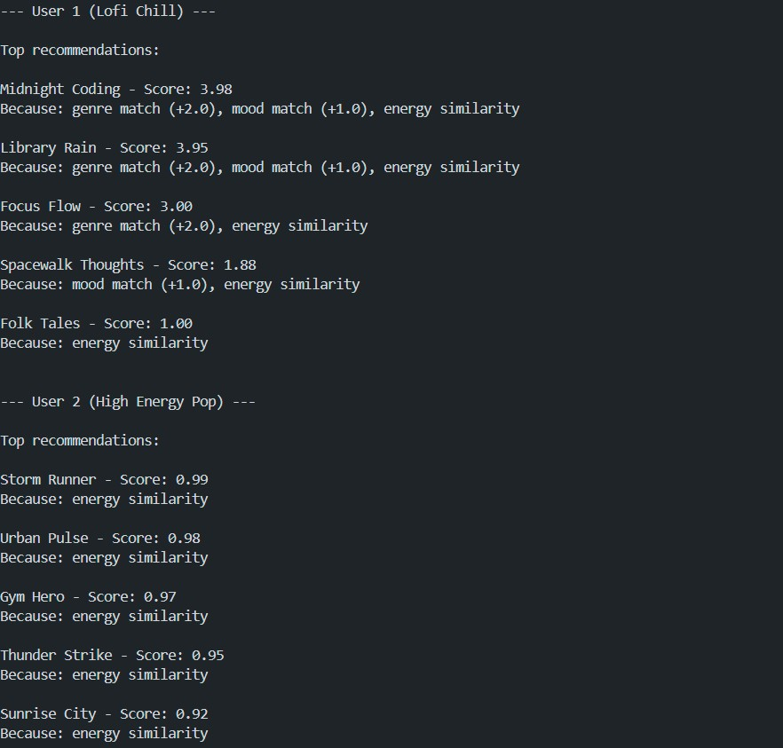
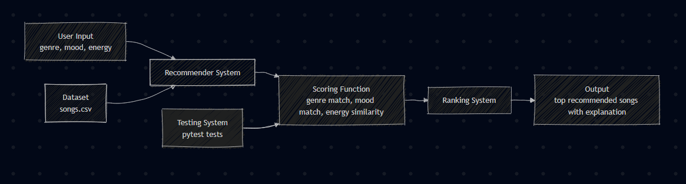

# 🎵 Music Recommender Simulation

## Project Summary

In this project, I created a simple music recommender system that suggests songs based on a user's taste profile. It compares song features like genre, mood, energy, and tempo with what the user prefers.

Platforms like Spotify and YouTube use similar ideas. They use collaborative filtering, which looks at other users’ behavior such as likes, skips, and playlists. They also use content-based filtering, which focuses on song features like genre, tempo, and mood.

This project shows how user data and song features can be used together to generate personalized song recommendations.
---

## How The System Works

In real-world systems like Spotify or YouTube, recommendation engines use both user behavior (likes, skips, playlists) and song features to predict what users will enjoy. They often combine collaborative filtering and content-based filtering to improve recommendations.

In this project, the system uses content-based filtering. It compares song features with a user’s preferences to recommend songs that match their taste.

### Features Used

- **Song features:** genre, mood, energy, tempo_bpm, valence, danceability, acousticness  
- **UserProfile features:** preferred genre, preferred mood, target energy level, and preference for acoustic music  

### Scoring Rule

The recommender assigns a score to each song based on how well it matches the user’s preferences.

- **Categorical features (genre, mood):**  
  If the song matches the user’s preference, it gets a score of 1. Otherwise, it gets 0.

- **Numerical features (energy, tempo, valence):**  
  The score is based on how close the song’s value is to the user’s preference using:  
  score = 1 - |song_value - user_value|

- **Weighted total score:**  
  genre (0.3), mood (0.3), energy (0.2), tempo (0.1), valence (0.1)

### Ranking Rule

After calculating scores for all songs, the system sorts them from highest to lowest score and recommends the top k songs.

### Algorithm Recipe

The recommender system assigns a score to each song based on how well it matches the user’s preferences.

- **+2.0 points for a genre match**  
  If the song’s genre matches the user’s favorite genre, it receives 2 points.

- **+1.0 point for a mood match**  
  If the song’s mood matches the user’s preferred mood, it receives 1 point.

- **Similarity score for energy**  
  The system calculates how close the song’s energy is to the user’s target energy using:  
  score += (1 - |song_energy - user_energy|)

After calculating the total score for each song, all songs are sorted from highest to lowest score. The system then recommends the top k songs with the highest scores.

### Limitations and Bias

This recommender system has some limitations. It mainly focuses on matching genre and mood, which means it may over-prioritize these features and ignore other important aspects of music. For example, a song with a different genre but a very similar vibe might not be recommended.

The system also uses simple numerical comparisons for features like energy, which may not fully capture how users perceive music. Additionally, because the dataset is small, the recommendations may not be very diverse.

In real-world systems, much larger datasets and more advanced methods are used to reduce bias and improve recommendation quality.

flowchart TD
    A[Start] --> B["Input: User Preferences<br/>(genre, mood, energy)"]
    B --> C[Load songs from CSV]
    C --> D[Initialize empty scores list]
    D --> E[For each song in songs]
    E --> F{Genre match?}
    F -->|Yes| G[genre_score = 2]
    F -->|No| H[genre_score = 0]
    G --> I{Mood match?}
    H --> I
    I -->|Yes| J[mood_score = 1]
    I -->|No| K[mood_score = 0]
    J --> L["energy_similarity = 1 - <br/>abs(energy difference)"]
    K --> L
    L --> M["total_score = genre_score <br/>+ mood_score + energy"]
    M --> N[Store song with score]
    N --> O{More songs?}
    O -->|Yes| E
    O -->|No| P[Sort by score descending]
    P --> Q[Select top K songs]
    Q --> R[Output recommendations]
    R --> S[End]
    

## Demo


## Stress Test Results

### User 1 (Lofi Chill)


### User 2 (High Energy Pop)


## Step 2: Accuracy and Surprises

For User 1 (Lofi Chill), the recommendations feel accurate. Songs like "Midnight Coding" and "Library Rain" are ranked at the top because they match both the preferred genre and mood, and also have similar energy levels.

The top song ranked first because it received the highest score from the scoring system. It got +2 for matching genre, +1 for matching mood, and additional points from energy similarity.

For other users, the recommendations were less accurate because most songs only matched energy and not genre or mood. This shows that the system depends heavily on genre and mood to give better recommendations.

## Step 3: Data Experiment

I tested the system by removing the mood feature from the scoring function.

After commenting out the mood check, the rankings changed. For example, for User 1 (Lofi Chill), "Focus Flow" became the top recommendation instead of "Midnight Coding". This happened because the system no longer considered mood, and only used genre and energy similarity.

The scores also became lower overall since the +1.0 mood bonus was removed.

The results felt less accurate because mood is an important part of music preference. Without it, the system could not distinguish between songs with similar energy but different moods.

This experiment shows that mood plays a significant role in improving recommendation quality.
---

## Getting Started

### Setup

1. Create a virtual environment (optional but recommended):

   ```bash
   python -m venv .venv
   source .venv/bin/activate      # Mac or Linux
   .venv\Scripts\activate         # Windows
  
# AI Music Recommender System

## Project Description
This project is an AI music recommender system that suggests songs based on user preferences such as genre, mood, and energy level.

## How It Works
The system compares user preferences with song attributes and calculates a score based on:
- Genre match
- Mood match
- Energy similarity

Songs are ranked by score and the top results are returned.

## AI Feature
This system uses a multi-factor scoring algorithm and provides explanations for each recommendation, making the system transparent and interpretable.

## Example Output
Midnight Coding - Score: 5.46  
Because: Genre match (+2.0), Mood match (+1.5), Energy similarity (0.98)

## How to Run
python -m src.main

## Screenshots of Program Output



## System Architecture



## Original Project

This project is based on my Module 3 project: **AI Music Recommender Simulation**.  
The original system recommended songs based on user preferences such as genre, mood, and energy level. It used a basic scoring function to rank songs but had limited explanation and structure.

## Title and Summary

This project is an AI Music Recommender System that suggests songs based on user preferences such as genre, mood, and energy. It uses a multi-factor scoring system and provides explanations for each recommendation. This helps users understand why certain songs are recommended and improves transparency.

## Architecture Overview

The system consists of several components: user input, a recommender system, a scoring function, and a ranking system. User preferences and song data are processed through the scoring function, which evaluates genre, mood, and energy similarity. The system then ranks songs and outputs the top recommendations along with explanations. A testing system is included to validate the scoring logic.

## Setup Instructions

1. Clone the repository:
   git clone <your-repo-link>

2. Navigate to the project folder:
   cd applied-ai-system-project

3. Install dependencies:
   pip install -r requirements.txt

4. Run the program:
   python -m src.main

## Sample Interactions

### User 1 (Lofi Chill)
Input:
genre = lofi, mood = chill, energy = 0.4  

Output:
Midnight Coding - Score: 5.46  
Because: Genre match (+2.0), Mood match (+1.5), Energy similarity (0.98)

---

### User 2 (High Energy Pop)
Input:
genre = pop, mood = happy, energy = 0.9  

Output:
Sunrise City - Score: 5.34  
Because: Genre match (+2.0), Mood match (+1.5), Energy similarity (0.92)

## Design Decisions

I used a multi-factor scoring system because it allows the recommender to consider multiple aspects of user preferences. I assigned higher weights to genre and mood because they are more important for music preference, while energy similarity provides fine-tuning. A trade-off is that the system relies on exact matches for genre and mood, which may limit recommendations if the dataset is small.

## Testing Summary

The system was tested using multiple user profiles and edge cases. The scoring function consistently ranked relevant songs higher when genre and mood matched. One limitation is that when no genre or mood matches are found, the system relies mainly on energy similarity. This showed that the dataset size and diversity affect recommendation quality.

## Reflection

This project helped me understand how AI systems use data and logic to make decisions. I learned how to design scoring algorithms, explain AI outputs, and structure a system clearly. It also showed me the importance of testing and making AI systems transparent and understandable.